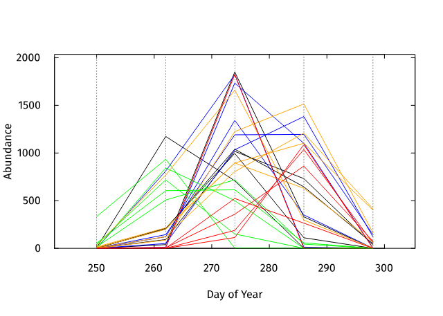
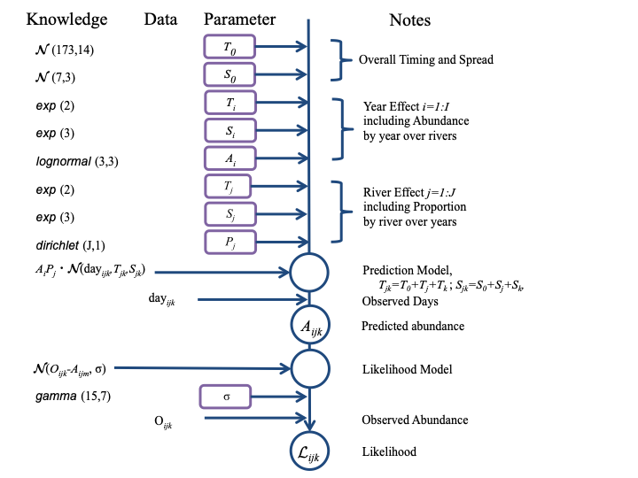

# Introduction

> ***Let the data speak for itself... but all the data must speak.***\
> - John P. Cunningham (2012)

Estimates of the number of [sockeye salmon](https://en.wikipedia.org/wiki/Sockeye_salmon "Wikipedia") (*Oncorhynchus nerka* Walbaum 1792) spawners in a river or a lake beach involve repeated surveys during the spawning period. Typically spawning is about one month after the autumnal equinox but timing varies greatly within and between species of *Oncorhynchus*. Techniques vary, conventionally: mark-recapture, and visual counts while snorkeling, walking, or flying in a helicopter or small airplane; recently: analyzing video from drones. There are many other methods to estimate abundance: mark-recapture, conductivity sensors, counting fences, and eDNA. Other salmon species may be counted in a survey for sockeye, and each salmon species has a diversity of enumeration methods.

The analysis of repeated surveys of sockeye spawners is conventionally an area under the curve estimate (AUC) where the "curve" is typically the area under straight lines joining observations versus days (a trapezoid). This analysis is the same as determining the cumulative abundance, again as straight lines between (accumulating) observations. The data may be supplemented with prior knowledge or subjective judgments about first, peak, and last presence of spawners. One improvement assumes a Gaussian ($\mathcal{N}(\mu,\sigma)$, normal) distribution for the temporal pattern of abundance, fitted to a time series survey estimates. These analyses are confined to the samples for one river in one year, so parameter estimates are based on few data, \< 10, and abundance estimates are accordingly imprecise.

The intention of this exercise is to show, using simulated data, that AUC estimates can be improved by considering multiple rivers and multiple years in a multi-level regression. The ideas are:

-   there will be an effect in common due to years on the temporal pattern of abundance in a group of river. Marine migration might be early or late, rainfall to raise water levels sufficiently for salmon to enter the rivers may be early or late.
-   a river can have a consistently different temporal pattern from other river. Spawners that home to that river can arrive earlier or later, and more or less spread in time.
-   a river can have consistently more or fewer salmon compared to other rivers. Factors such as length of accessible river and the abundance of gravel suitable for spawning (for redds) affect salmon abundance.; and
-   the abundance of spawners across all rivers varies by year. Implicit is that these spawning groups in rivers (salmon tribes?) are related within a population or conservation unit (metapopulation).

These ideas can be assembled into an equation

$$
N_{tjk} = N_j P_k (T_0[\mu,\sigma]_t + T_j[\mu,\sigma]_t + T_k[\mu,\sigma]_t) + \epsilon_{tjk}
$$ {#eq-NTJK}

where $N_{tjk}$ is the number of spawners on day *i* in river *k* in year *j.* That is estimated with error $\epsilon$ from the proportion $P_k$ of all spawners that year $N_j$ which enter river *k* according to the background temporal pattern $T_0$ and how that pattern is affected by the pattern for that year $T_j$ and that river $T_k.$ The expression $T_x[\mu,\sigma]_t$ refers to a temporal distribution with parameters $\mu_x$ and $\sigma_x$ for timing and spread (if the normal distribution is chosen).

The normal distribution might be a sufficient description for the temporal abundance of spawners despite being symmetrical and unbounded. Reality might be better described as a truncated and skewed Gaussian distribution, or by a distribution that is inherently bounded. The beta distribution, for example has the advantage that, after determining bounds such as the first and last important abundance of spawners in all rivers (in the region being analyzed) then river effect and year effect might be sufficiently described by a single parameter, the day of peak abundance (mode), that determines the shape of the beta distribution between those bounds (the skew).

```{r}
#|label: setup
#|echo: false
library(rstan); library(magrittr) 
```

```{r}
#| label: local_functions
#| echo: false
# add dimension names to an array. There has to be a better way.
ArrayDimNames <- function (a, names){ 
  # a is an array 
  # names with length(dim(a)), one name for each dimension 
  dims=dim(a) 
  ndims=length(dims) 
  if (length(dims) > 4) stop("ArrayDimNames: only defined for 3 or 4 dimensions") 
  result <- list( rep(names[1],dims[1]),
                  rep(names[2],dims[2]), 
                  rep(names[3],dims[3]) ) 
  if((length(dims) == 4)){
      result <- list( rep(names[1],dims[1]),
                      rep(names[2],dims[2]), 
                      rep(names[3],dims[3]),
                      rep(names[4],dims[4]) ) 
    }
  return(result) 
  } 
# example: 
# ArrayDimNames(a=array(dim=c(3,3,3)), names=c("dog","fox","bat")) 
# [[1]][1] "dog" "dog" "dog" 
# [[2]][1] "fox" "fox" "fox" 
# [[3]][1] "bat" "bat" "bat"

# day of the year if not leap year
doy=cumsum(c(0,31,28,31,30,31,30,31,31,30,31,30,31)); 
# 0 31 59 90 120 151 181 212 243 273 304 334 364 
# used as doy(month) where month is 1:12.
# add 1 if (month > 2) & (0 == (year %% 4) )  leap year
# add 10 to be solar day, Dec.21 = 0 = 365. 

# truncated Normal distribution (tails trimmed). 
# This begs to be recursive.
RtruncNorm <- function(n=1,m=0,s=1,t=2){ 
# t is truncation, how many sd tolerable? default is 2 
  a <- rnorm(n); 
  print(a); 
  r <- max(abs(a)); 
  print(r) 
  while(r > t){ 
    j <- a > t; 
    print(j) # where exceeds 
    a[j] <- rnorm(sum(j)) # try again where exceeds 
    r <- max(abs(a)) # OK yet? 
  } 
  result <- a*s+m 
  return(result)
}
```

## Examples of Samples

### Temporal patterns from year and river effects.

Simulate data applies the normal distribution for the overall abundance of spawners with timing (mean, $\mu$ ) centered on day 273, the end of September, and a spread (sd, $\sigma$) of 7 days. The year effect on the timing (mean) for spawner abundance in one river is drawn from a random normal distribution with sd = 5 days and mean = 0. The year effect on the spread (sd) of the spawner abundance in a river is similar, random normal with sd = 1.5 days and mean = 0. The river effects are the same, random normal with timing sd = 5 days and spread sd = 1.5 days.

The following code creates a three dimensional array of *n_day* observations in each of *n_river* rivers in each of *n_year* years.

```{r}
#|label: temporal_patterns
# mean and SD of salmon abundance after removing year
# and river effects. Day 270 is September 30 (not leap year)
background <- c(273, 7)  
# storage for simulated data
n_day <- n_river <- n_year <- 5;  # remember: arrays stored by first index
trueAbundance <- array(dim=c(n_day, n_river, n_year));
dimnames(trueAbundance) <-list(
    day=1:n_day,river=LETTERS[1:n_river],
    year=1991:(1991+n_day-1) )

# river size effect:proportion across all years, of spawners in that river
river_size <- runif(n_river,1,10);   # random uniform.
river_size <- river_size/sum(river_size); # proportion
# temporal effects effects
yearSD <- c(5,1.5) # effect on timing and spread
riverSD <- c(5,1.5) 
yearEffect <-  cbind(rnorm(n_year,   0, yearSD[1]),
                    rnorm(n_year,   0, yearSD[2]) ) # 2 columns
riverEffect <- cbind(rnorm(n_river, 0, riverSD[1]),
                     rnorm(n_river, 0, riverSD[2]), river_size) # 3 columns
dimnames(yearEffect) <- list(year=1991:(1990+n_day),
                            effect=c("timing", "spread"));
dimnames(riverEffect) <- list(river=LETTERS[1:n_river], 
                            effect=c("timing", "spread", "size"));
cat(  ' Year Effect   \n'); print(yearEffect)
cat('\n River Effect \n'); print(riverEffect)

```

### Examine total effect.

The random, additive effects of rivers (A, B, C,) and year (1991, 1992,) are calculated for timing and spread.

```{r}
#| label: tot_eff
b1  <- matrix(nrow=n_river, ncol=n_year); 
dimnames(b1) <- list(river=LETTERS[1:n_river], year=1991:(1990+n_day) ) 
b4 <- b3 <- b2 <- b1 
cat("riverEffect+yearEffect. Timing (mean) \n") 

for(year in 1:n_year){
  for(river in 1:n_river){
    b1[river, year]=riverEffect[river,1]+yearEffect[year,1];
  } 
} 
print(b1) 
cat("\n riverEffect+yearEffect. Spread (SD) \n") 

for(river in 1:n_river){
  for(year in 1:n_year){
    b2[river, year]=riverEffect[river,2]+yearEffect[year,2];
  } 
} 
print(b2) 
# earliest and last abundance across all rivers and years 
# needed to determine sampling days 
b3 <- b1 - 1.5*(b2+background[2]); 
# first case revealed 
cat("\n Early due to river and year effects \n"); 
print(b3); 
b4 <- b1 + 1.5*(b2+background[2]); 
# last  case revealed 
cat("\n Late due to river and year effects \n"); 
print(b4)
```

### Generate sampling days

As a starting point, sampling days are the same for every river every year. The range of sampling days has to cover the range of days when salmon are abundant in any river. That is determined from -1 sd of abundance distribution for the most early case of river and year, and +1 sd for most delayed case.

```{r}
#| label: samp_days
# sampling days. Cover expected range across all years and rivers. 
j <- which.min(b3); # earliest case 
a1 <- b3[j]+background[1];  # value for this case 
cat('earliest case',a1, 'timing effect', b1[j],
    'spread effect', b2[j],'\n') 
j <- which.max(b4);  # most delayed case 
a2 <- b4[j]+background[1]; 
cat('last case',a2,'timing effect', b1[j], 
    'spread effect', b2[j], '\n')
days <- seq(a1, a2, length.out=n_day); 
days <- floor(days) # integer days 
cat("\n Days of the year for observations:", days,"\n")

```

### Abundance by day

The relative abundance of salmon in one river is taken as fixed and independent of years. This is true only when considering the potential abundance of spawners ("capacity" refers to some measure of output of salmon, not input of spawners). The spawning populations in a river may thrive or dwindle for many reasons: fishing, predators, disease,. These random effects within rivers across years will fall into the unexplained variance.

```{r}
#|label: abund_day
# total abundance by year 
totalYearly <- rnorm(n_year, 1e5, 0.25e5) # abundance by year 
# abundance by day by river by year. 
for (river in 1:n_river) { 
  for (year in 1:n_year) { 
    trueAbundance[,river,year] <- totalYearly[year] * riverEffect[river,3] *
    dnorm(days, 
      background[1]+riverEffect[river,1]+ yearEffect[year,1], # mean 
      background[2]+riverEffect[river,2]+ yearEffect[year,2]) # SD 
  } 
} 
j <- is.na(trueAbundance) | trueAbundance < 0.1 
trueAbundance[j] <- 0

par(tck=0.02, las=1, yaxs="i") 
color <- c("black","blue","green","orange","red");
plot(1,1,type="n", 
  xlim=c(-5,5)+range(days), 
  ylim=c(.9,1.1)*range(trueAbundance), 
  xlab="Day of Year", ylab="Abundance"); 
axis(3,labels=F); axis(4,labels=F); 

for (river in 1:n_river) {
  for (year in 1:n_year) { 
    lines(days, trueAbundance[,river, year], col=color[river] ) 
  }
} 
abline(v=days, lty="dotted", col="grey50") 

```



## Area under the curve, Conventional Fit

To establish a contrast to AUC by river by year, we calculate the integral of total salmon abundance from the linear interpolation method and by fitting a normal distribution. Adjusting the linear interpolation by considerations such as a date for unobserved peak spawning is not included (yet).

A spawning salmon may be observed in more than one survey, so a key parameter to translate AUC into salmon abundance is the duration of a spawner in a river. While that duration may be a haphazard estimate, it directly affects abundance estimates and needs to be included in these models. Potentially all of the spawners observed after peak abundance were also observed at peak abundance. This has led to simplifying the survey analyses to be maximum spawners observed. This value is included in the result because the relative abundance of spawners, from some uncalibrated index of abundance, such as maximum spawners observed across multiple surveys in one river and one year, may be sufficient for fisheries management.

## Calculations without observation error

Knowing how the precision of estimates of total changes with increasing observation error seems valuable. The baseline is zero observation error. The following code provides functions for exploring the effects of observation error, which I have not yet done. (perhaps Gaussian Process regression?)

### function for linear AUC

```{r}
#| label: linear_auc
# linear interpolation with irregular intervals.
# each observation applies to half the preceding inteval and half the following.
AUC <- function(days,dat) { # x,y. vectors
  n=length(dat)
  if (length(days) != n) stop("AUC: lengths differ");
  interval <- days[-1] - days[-n]; # second minus first, etc. length n-1
  weight <- interval/2 # n-1 of these
  weight <- c(0,weight)+ c(weight,0); # for non-uniform intervals
  auc <- sum (weight * dat)
#  cat('weight', weight,'\n')
  return(auc)
}
test_dat <- c(1,3,5, 2,1 ); # not symmetrical
test_day <- c(2,5,8,11,14);
AUC(test_day, test_dat ) # 12
```

## function to fit normal distribution

The log of a normal distribution is a parabola

$$
log(P_x)= log(\frac{1}{\sigma \sqrt{2\pi}})+ \frac{(x-\mu)^2}{2\sigma^2}
$$

$$
log(y)= \frac{-1}{2}log(2\pi\sigma^2) + \frac{x^2 - 2 \mu x +\mu^2}{2\sigma^2}
$$

$$
log(y)=  -0.5 \left( log(2\pi\sigma^2) + \frac{\mu^2} {\sigma^2} \right) -x \frac{2\mu}{2\sigma^2} + x^2 \frac{1}{2\sigma^2}
$$

$$
log(y) = a + bx +cx^2
$$

where

$a=-.05 \left( log(2\pi\sigma^2 ) +(\mu / \sigma)^2 \right) ,$ $b= -0.5 \mu / \sigma^2,$ and $c= 0.5/\sigma^2.$

After linear regression of $y=a+bx+cx^2,$ the mean and standard deviation can be recovered as $\mu= 0.5 \ c/b$ and $\sigma=\sqrt{-0.5/c}.$

The Gaussian integral (LaPlace 1782, Gauss 1809) is the *area under the curve* of a normal distribution with $\mu=0$ and $\sigma^2=1/2.$

$$
\int_{-\inf}^{\inf}e^{-x^2}dx=\sqrt{\pi}
$$

There is an extension applicable to the parabola obtained by regression with the log of abundance data. The antilog of the preceding fitted parabola (parameters $a, b,c$) is a normal distribution, and there is a analytic solution for the integral of the antilog of a parabola,

$$
\int_{-\inf}^{\inf}e^{a+bx-cx^2}dx= \sqrt{ \frac{\pi}{c}} \  e^{ \frac{b^2}{4c} +a}
$$

That integral is the total abundance, *aka* area under the curve, *aka* Gaussian scaling factor. See [link.](https://en.wikipedia.org/wiki/Gaussian_integral)

Fitting to log abundance emphasizes the contribution to the sum of square of residuals from small abundance estimates compared to large. Are small abundance estimates more or less precise than large? Which abundances are more important to estimate accurately? On the other hand, if the precision of each abundance estimate can be quantified, then a weighted regression can be used. This is deferred, because it is more likely that relative precision is known (ranking, ordinal).

```{r}
#|label: parabola
# the log of a normal distribution is a parabola 
AUCnormal <- function(dat, day){   
    day2 <- day^2   
    y<- log(dat)   
    a <- lm (y ~ day + day2)  
    return(a) 
} 
test_dat <- c(1,3,5,2,1); # not symmetrical 
test_day <-c(2, 5, 8, 11, 14); 
a <- AUCnormal(test_dat, test_day); 
p <- coefficients(a) 
print(summary(a)); 
print(p); 
y <- predict(a) # data=test_day, default predicted by regression  

par(tcl=0.2) 
plot(log(test_dat)~test_day, pch=20, yaxs="i",
     xlim=c(0,1.2*max(test_day)),ylim=range(y)*c(.8,1.2)); 
points(test_day,y) 
x= seq(min(test_day), max(test_day), length.out=20) 
y <- p[1]+ p[2]*x+p[3]*x^2 
lines(x,y)  

# extract Gaussian parameters from regression parameter estimates 
mu <- -0.5* p[2]/p[3]; 
sigma <- sqrt(-0.5/p[3]); 
# be careful: regression y=a+bx+cx^2 represents math y=a+bx-cx^2 
# so see c as -c, see? So, 
auc <- sqrt(pi/(-p[3]))*exp( (p[2]^2)/(4*(-p[3])) +p[1]);  
cat('\n mu =', mu, 'sigma =', sigma,'auc =',auc, '\n') 
abline(v= mu+sigma* c(-2,-1,0,1,2), lty='dotted',col='blue') 

# not logged 
plot(test_dat~test_day, pch=20, yaxs="i",
     xlim=c(0,1.2*max(test_day)),ylim=c(0, 1.2*max(test_dat)));
y1 <- exp(y); # antilog 
lines(x, y1); 
mean0 = sum(test_dat*test_day) / sum(test_dat); 
sd0 = sqrt( sum(test_dat*(test_day-mean0)^2)/(sum(test_dat)-1)) 
cat('\n simple weighted mean =',mean0,' with sd =', sd0,'\n') 
y2 <- dnorm(x,mean0,sd0) * auc; # crude normal scaled to total abundance
lines(x,y2,col="blue"); 
abline(v= mean0+sd0* c(-2,-1,0,1,2), lty='dotted',col='blue')
```

## Nonlinear regression (search) for normal distribution

This model minimizes the squares of residuals from trial values of parameters to estimate $\mu, \sigma, \text{and } N$ . It has the advantages of (1) fitting a complete distribution to possibly truncated observations (started late or ended early), (2) does not emphasize the importance of small abundances compared to large, and (3) provides a direct estimate of the precision of the fitted value for AUC.

```{r}
#|label: fitGauss
# the model and the optimization in one function 
fitGaussian <-function(x,y,mu,sigma,scale){
  f = function(par){  # par is c(mu,sigma,scale), searched by optim()
    d = par[3]*dnorm(x,mean=par[1],sd=par[2]) # predicted from trial values in par     
    ssq=sum((d-y)^2) # minimize SSQ (or another distance)
    return(ssq)
  }   
  optim(par=c(mu,sigma,scale),f, hessian=T) 
  # search for minimum, starting from guesses. 
  # Return curvature of SSD manifold at best fit for parameters (Hessian)
} 
a <- fitGaussian(test_day, test_dat, mu=7.8,sigma=3.5, scale=36); 
mean1 <- a$par[1]; 
sd1 <- a$par[2]; 
auc1 <- a$par[3]; 
SSres <- a$value; 
se <- sqrt(diag(solve(a$hessian)));  
r2 <- 1-SSres/sum((test_dat - mean(test_dat))^2); # SSreg/SSmean 

cat(sep='', 'mean=',  round(mean1,2), '(', round(se[1],2),
    '), sd=',  round(sd1,2),   '(', round(se[2],2),
    '), auc=', round(auc1,2),  '(', round(se[3],2),
    '), r2=',  round(100*r2,0),'% \n' ); 

par(tcl=0.2); 
plot(test_dat~test_day, pch=20, yaxs="i",
     xlim=c(0,1.2*max(test_day)),ylim=c(0, 1.2*max(test_dat))); 
lines(x, auc1*dnorm(x, mean1, sd1)) 
abline(v= mean1+sd1* c(-2,-1,0,1,2), lty='dotted',col='blue')
```

### Monte Carlo fit

As the first step to a Bayes-LaPlace approach to fitting a multi-level regression, the conventional one river in one year approach with Hamiltonian Monte Carlo. This uses the Stan language for Bayesian statistics via R package *rstan*.

Over-fitting is a problem for prediction in ecological systems with a superabundance of habitat indicators. Leave-one-out statistics, where the predicted value of each data point, when it is omitted from the data used to fit the model, is a safeguard against over-fitting. The latest development \[*as of writing*\] of this is "PSIS-LOO" (Betancourt *et al*., 2017), available via R package *loo*.

experience: scheduling, downloading, booting R_stan took \~70 seconds. The following test of rstan completed in 76 seconds, mainly compiling. Sampling took less than 1/10 second.

```{r}
#|label: test-rstan
#|eval: false
#|echo: false
# library(rstan) 
stancode <- ' 
    data {real y_mean;}  
    parameters {real y;}  
    model {y ~ normal(y_mean,1);}' # from  R help: stan_model 
 mod <- stan_model(model_code = stancode) 
 fit <- sampling(mod, data = list(y_mean = 0)) 
 print(fit) 
 fit2 <- sampling(mod, data = list(y_mean = 5)) 
 print(fit2)
 
#  ## fit 
# 4 chains, each with iter=2000; warmup=1000; thin=1; 
# post-warmup draws per chain=1000, total post-warmup draws=4000.
#       mean se_mean   sd  2.5%   25%   50%   75% 97.5% n_eff Rhat
# y     0.02    0.03 1.00 -1.89 -0.65  0.03  0.68  2.01  1473    1
# lp__ -0.50    0.02 0.71 -2.54 -0.66 -0.22 -0.05  0.00  1528    1
# 
#  ## fit2
# 4 chains, each with iter=2000; warmup=1000; thin=1; 
# post-warmup draws per chain=1000, total post-warmup draws=4000.
#       mean se_mean   sd  2.5%   25%   50%   75% 97.5% n_eff Rhat
# y     4.99    0.03 0.99  3.01  4.32  4.97  5.68  6.95  1297    1
# lp__ -0.49    0.02 0.69 -2.55 -0.64 -0.23 -0.05  0.00  1811    1

```

```{r}
#|label: stan_Gauss
#|cache: true
# library(rstan) 
stan_Gauss_code <- " 
functions {
    // Gaussian probability density distribution
    // faster than (1/(sigma*sqrt(2pi)))*exp(-(1/2)*((x-mu)/sigma)^2) 
    //  1/sqrt(2*pi) = 0.3989423  
  vector Gauss(vector x, real mu, real sigma) { 
    real inv_sigma;
    inv_sigma = 1./sigma;
    return 0.3989423*inv_sigma*exp(-0.5* square((x-mu)*inv_sigma));
  } 
} 
data { 
  int<lower=0> np;  // count of prior (8) 
  vector[np] prior; // timing: m,s; spread: m,s; auc: m,s 
  int<lower=0> n;   // count of data 
  vector[n] x;      // day of year for observation 
  vector[n] y;      // estimate of abundance for that day 
} 
parameters { 
  real <lower=0> timing;  // mean of Gaussian 
  real <lower=0> spread;  // standard deviation of Gaussian 
  real <lower=0> auc;     // area under curve, total abundance 
  real <lower=0> sigma;   // sd of residuals 
} 
model {
  vector[n] ypred; 
  // prior knowledge 
  timing ~ normal(prior[1], prior[2]); 
  spread ~ normal(prior[3], prior[4]); 
  timing ~ normal(prior[5], prior[6]); 
  sigma ~ gamma( prior[7], prior[8]); 
  // prediction from trial parameters
  ypred = auc * Gauss(x, timing, spread);  // Gauss returns a vector 
  // likelihood of data given prediction 
  y~normal(ypred, sigma); 
} "

stanc_ret <- stanc(model_code = stan_Gauss_code) # check syntax, compile 
stan_Gauss <- stan_model (stanc_ret=stanc_ret) # create model
```

```{r}
#|label: test_and_guess
# create test data and initial guesses
# background temporal distribution
timing <- 280.0; # day of year mean (peak) spawner abund.
spread <-  15.0; # std dev of Gaussian spawner abund.
auc <- 2000.0;   # abundance of spawners
n = 8; # number of obsevations, number of days
# x is day of observation (day of Julian year)
x <-  seq(from=timing-2*spread,to=timing+2*spread, length.out=n) %>% floor; 
# y is estimates of abundance
y0 <- (auc * dnorm(x,timing, spread)) %>% round(0); # without error
y  <- (y0 *  rnorm(y0,1,0.2))         %>% round(0); # 20% error
cat(' x  =',x,'\n y0 =',y0,'\n y  =',y,'\n');

# ----- priors ------
    # guess for auc is linear AUC
auc <- round(AUC(x,y), 0);
    # guess for timing is day weighted by count
ptm <- round(sum(x*y)/sum(y), 0); # ptm abbreviates prior timing mean
    # guess for spread is weighted variance 
psm <-  round(sqrt(sum( y* (x-ptm)^2)/sum(y)), 0) # ignore supposed bias

plot(x, y0, pch=20, ylim=c(0,1.2*max(y)) ); 
    points(x,y); lines(x,auc*dnorm(x,ptm,psm));
cat(sep='', 'calculated priors: timing =',ptm,', spread = ',psm,', AUC = ',auc,'\n') 
# sigma (sd of normal residuals) has prior gamma(shape=5, scale=1)
k=exp(seq(-4,3,.25));  # interested in behaviour near zero

plot( k,dgamma(k,shape=5, rate=1), type="l",ylim=c(0,0.25),
      ylab='dgamma(k)', main='sigma, gamma: shape: 5 (black), 10 (red)' );
lines(k,dgamma(k,shape=10,rate=1), col="red");

prior <- c(
  timing_m = ptm,       # 1. about Julian day 280 (Sept. 30 is 273) 
  timing_s = 7.0,       # 2. range, 4 sd is 1 moon orbit 
  spread_m = psm,       # 3. about 2 moons. 
  spread_s = 3,         # 4. range 1 to 4 moons. Avoid negative! 
  auc_m    = auc,       # 5. simplest estimate
  auc_s    = 0.25*auc,  # 6. expect 0/5 to 1/5 of estimate
  sigma_shape = 10.0,   # 7. high and wide. Y should be scaled: y/max(y) 
  sigma_scale = 1.0)    # 8. 
print(prior) # shows names
dat <- list(np=8, prior=prior, n=8, x=x, y=y); 

# might need to initialize HMC
# one chain for testing
# init1 <- list(
#  chain1=list(timing=ptm, spread=psm, auc=auc, sigma=10.0));
# print(as.data.frame(init1));
#  four chains for fitting
# init4 <- list(
#  chain1=list(timing=ptm*1.10, spread=psm*1.10, auc=auc*1.10, sigma=12.0),
#  chain2=list(timing=ptm,1.05, spread=psm*1.05, auc=auc*1.05, sigma=10.0),
#  chain3=list(timing=ptm*0.95, spread=psm*0.95, auc=auc*0.95, sigma=8.0),
#  chain4=list(timing=ptm*0.90, spread=psm*0.90, auc=auc*0.90, sigma=6.));
# print(as.data.frame(init4));

# I used these print statements in model block to debug Stan code
#  with (iter=1, chains=1); 
#      // print("timing =",timing); // to check Stan code
#      // print("spread =",spread);
#      // print("auc =",auc);
#      // print("sigma =",sigma);
#      // print("x =",x);
#      // print("y =",y);
#      // print("ypred =",ypred);
```

### Test function Gauss()

test my function in Stan function block by using expose_stan_functions

```{r}
#|label: test_Gauss
#|cache: true
expose_stan_functions(stan_Gauss); 
Gauss(c(2,3,4), 0, 1); 
  # [1] 0.0539909665 0.0044318484 0.0001338302 
 dnorm(c(2,3,4), 0,1) 
  # [1] 0.0539909665 0.0044318484 0.0001338302
```

### Fit stan_Gauss

```{r}
#|label: fit_stan_Gauss
#|warning: false
#|cache: true
fit <- sampling(stan_Gauss, data=dat, chains=4, iter=2000); # init=init1);
print(fit) 
pairs(fit, condition=0.2); # plot
```

### Experience

Stan is *strongly typed* to enforce rigor in coding, an attempt to avoid subtle bugs. Which takes some getting used to, a contrast to R. I found **vector\[n\] x** confusing compared to **real x\[n\]**, the latter being an array, so you could have **real\[m\] x\[n\]** which would be n arrays of m values. And then row_vectors which are not vectors or arrays, nor rows or columns of a matrix. I see the point: protect domain experts from their otherwise sloppy linear algebra.

This model does not work with the default improper priors, the sampling heads off to $\text{spread} \to \infty$ despite initializing in the vicinity of the best fit. The prior knowledge assigned to parameters is derived from simple models applied loosely (large values for the prior regarding range of a parameter). Because there is adequate data, the effect of prior knowledge will be small. When there is a lot of data, by modeling many years and rivers at one, the effect of prior knowledge (*a priori* probability distributions for parameters) on the results (ditto but *a posteriori*) will be smaller again.

Parameters were recovered accurately, but that is because the true model was known. The true model is unknown (and effectively infinitely complicated) and a serviceable while simplistic description will be discovered from exploring real data.

## Many Rivers, Many Years

### Multilevel Regression

A simple, linear, multivariate, multilevel regression model would be

```{=tex}
\begin{equation*}
\begin{aligned}
y &= \mathcal{N} (\hat{y}, \  \sigma) \\
  &= \mathcal{N} (\alpha + X \beta + Z \gamma, \  \sigma) 
\end{aligned}
\end{equation*}
```
where ***X*** is the matrix of independent variables and the fitted parameters $\alpha$ (intercepts) and $\beta$ (slopes) define the overall or average linear regression, the "fixed effects". If there were no more to the model, this would describe 'complete pooling" of the data.

The matrix ***Z*** describes the groups in ***X*** and $\gamma$ is the fitted estimate of the deviation of the parameter $\alpha$ by groups (easily extended to have $\beta$ also vary by group). Thus $Z\gamma$ makes this similar to a *random effects* model, where, typically, the intention is to discern the fixed effects and discard the random effects: what is behind the noise that can be accounted for via groups?

In the Bayes-Laplace paradigm, the group effects are real, important for prediction, and modeled as random draws from a fitted distribution. Thus the group effects are not independent: information is shared. The choice of the group effects distribution involves prior knowledge (thus *hyper-priors* as pointless jargon) of its parameters. Those parameters are fitted as part of this model. The observed (dependent) variable to be predicted by the model, $y,$ and the residuals (predictions minus observations) are assumed (more prior knowledge) to have a Gaussian (normal) distribution $\mathcal{N}$ with standard deviation $\sigma.$

Some quotes, about how "partial pooling" shares information among groups, might be helpful at this point:

> "An extreme approach would be to completely pool all the data and estimate a common vector of regression coefficients *β*. At the other extreme, an approach with no pooling assigns each group its own coefficient vector$\beta$ that is estimated separately from the other groups. A hierarchical model is an intermediate solution where the degree of pooling is determined by the data and a prior on the amount of pooling." - Stan User's Guide version 2.19 page 23.

> " 'While complete pooling or no pooling of data across groups is sometimes called for, models that ignore the grouping structures in the data tend to underfit or overfit' (Gelman *et al.*, 2013). Hierarchical \[multi-level\] modeling provides a compromise by allowing parameters to vary by group at lower levels of the hierarchy while estimating common parameters at higher levels. **Inference for each group-level parameter is informed not only by the group-specific information contained in the data but also by the data for other groups as well.** This is commonly referred to as *borrowing strength* or *shrinkage*."\
> - <http://mc-stan.org/rstanarm/articles/glmer.html>

### River and Year Effects on Timing and Spread

The background model for temporal distribution of salmon spawner abundance is two parameters, timing and spread. This is applied to all years and all rivers. The other part of the background is the overall abundance of salmon for each year, the run size. If the data for all rivers were pooled, there would only be _n_year_ + 2 parameters.

The departure from that background for any one river, the river effect on timing and spread, is two parameters. In this model, the prior knowledge for the probability distributions for the river effect parameters proposes they are zero unless the data unambiguously supports the existence of such a year effect (across all of the rivers). The exponential probability distribution provides that effect, $Pr(x)=\beta e^{-\beta x}.$ This idea is used for lasso regression where the objective is to remove or ignore parameters that are unimportant.

To increase the effect of priors for parameters where the posterior marginal mean value (fitted value) is likely near zero, I used the LaPlace function, a double exponential. This was applied to the fitted distribution for year effects and river effects, because these are departures from an independently fitted overall mean for years and rivers, so year_timing, year_spread, river_timing, and river_spread have LaPlace$(0,\sigma)$ priors (Stan Functions Reference Version 2.32, section 19.7 page 206).

### Example of double exponential PDD, the LaPlace distribution

```{r}
#|label: double_exp
# example of double exponential probability density distribution
LaPlace <- function(x, mu, sigma){
    # // (1/(2*sigma)) * exp(-abs(x-mu)/sigma)
    inv_sigma= 1.0/sigma
    result = 0.5 * inv_sigma * exp(-abs(x-mu) * inv_sigma)
    return(result)
}
x <- seq(-5, 5, 0.5); # peak will be at sigma/2
mu <- 0.
sigma <- 2.
y <- LaPlace(x, mu, sigma);
cat('sum y = ', sum(y), '\n')
par(las=1,tcl=0.2, pch=20, yaxs="i");
plot(y~x, type='o', ylim=c(0.0, 1.1/(2*sigma)), ylab='Pr(x)' );
```

River effects are modeled the same way. These are fixed effects. It is likely a population in specific river will have a trend or a discontinuity, that could be a helpful parameter and might be related to a habitat variable for that river (flows, temperature, events). Correlations of timing and/or spread between rivers are likely (rivers behaving the same in terms of spawners), and across years (trends, shifts). There is no $year \times river$ effect, the ideosyncratic departure of a river in a year from expected norms is relegated to the unexplained variance.

-   Conceptually, if spawner timing for some year (mean day over all rivers) is late, then it may have less spread as a result of waiting for a migration barrier to drop.

-   Conversely, if spawner timing for some river (mean day over all years) is late it may have more spread perhaps because of an lengthy and arduous up-river migration (leading to diffusion of timing of arrival).

Those example indicate there will be habitat indicators that are covariates (predictors) for the stream and year effects on temporal distributions. I look forward to this model reapplied as the foundation for such extensions.

### River and Year Effects on Abundance

The area under the curve of spawner abundance is not the same as the number of spawners because a spawner will reside in the spawning ground for many days. That **residence time** may be longer for females guarding redds than for males that drift down-river after spawning. A model that involved the accumulation of identified spawners would involve a cumulative distribution function, possibly preferable. But in this case the total annual abundance of spawners over all rivers in a year, is not the run size considered as the number of salmon independent of multiple observations of the same fish. Determining number of fish from the sum of daily abundances of fish requires knowing the duration of a fish in a river. That will be an important calibration parameter, but probably complicated by the need for habitat indicators: perhaps warmer river temperatures mean shorter spawning ground residence.

Abundance is primarily a **year effect**. There is little prior knowledge other than *non-negative*, in this model, but that will not be typical. Autocorrelations apply, such as known long trends in salmon abundance, and four-year generation cycles (returns are largely age 1.2 (one freshwater year after spawning previous fall, 2 marine years), dependent on spawners four years previous). The application of this model is likely to involve known abundances for all but the last year.

Independent of years (or average over all years) there is a **river effect** for abundance: the proportion of the total that goes to each river. Perhaps proportions vary due to spawning ground area and/or quality, or river length. The existence of sub-populations (or populations within a metapopulation, a conservation unit, CU) of salmon that home to one stream and not to others is an important complication. This model assumes that any such sub-populations vary identically among years. The proportions by river sum to the entire abundance of salmon, therefore the fitted values for that vector of parameters ( with length *n_river*) are not independent, they must sum to unity. Such a vector is a simplex and a specific probability model is required to meet that constraint, the Dirichlet distribution (Gelman et al 2017, page ).

After considering temporal distributions and abundance by year and river proportion, the abundance in each year in each river (i.e. the AUC) is estimated as

$$
\hat{y}_{i,j,k}= \mathcal{N} (\text{day}_{i}, \mu_{j,k}, \sigma_{j,k})
$$

where the timing $\mu_{j,k}$ for river $j$ and year $k$ involves $n_river \times  n_year$ parameters. We might expect those parameters to have spatial correlation length scales (near or distant in measures of river properties) and temporal correlations (successive generations, population trends,) thus scope for additional data and knowledge to sharpen this type of model.

The daily observations are predicted from all of these parameters. The probability of that prediction, given the data and an assumption about the distribution of residuals, is the basis for describing the joint probability density in the parameter space, and thereby estimates of the parameters and their marginal distributions, e.g. median (50% quantile) with 10% and 90% quantiles to indicate precision. While the correlations between parameters are typically ignored for reporting, they is required for predicting. One aspect of predicting is to simulate data described by the fitted model and see if that looks like the observed data.

### River proportion

Describing the relative abundance of spawners between rivers as the proportion of salmon that enter that river means the fitted estimates for those proportions across all river must sum to 1. That vector of non-negative parameters is a *unit simplex*, the Direchlet distribution (Stan Functions Reference v2.19 §23.1 p126) describes the *multinomial* probabilities for values within a simplex. The Direchlet parameter describes how even the probabilities are, with large values (\>100) creating a even distribution and small values (\<1/100) creating extremes (one of \~1 and all others \~zero). Using 1 as the default looks like uniform random.

> data {\
> int \<lower=1\> n_river;\
> real \<lower=0\> alpha; // large alpha means even proportions.\
> }\
> parameters {\
> simplex \[n_river\] river_prop; // constrained 0\<x\<1 and sum=1.\
> }\
> model {\
> river_prop \~ direchlet(alpha); // sampling for run proportions\
> }

## Model Overview

> "In theory, a Bayesian model should include all relevant substantive knowledge and subsume all possible theories. In practice, it won’t."\
> - Jeffrey B. Arnold\
> <https://jrnold.github.io/bayesian_notes/model-checking.html>



Any assumed model is one of many possible variants, so we need a basis for comparing models. How the model fits data can be based on prediction ability using *cross validation* that will *leave one out* (LOO) when fitting, and then predict that *left out observation* from the fit. Conceptually, the fitting is repeated for every data point, but there is a mathematical alternative. The required information is the log likelihood of each data point; produced and saved in the *generated quantities* block in a Stan model. See <http://mc-stan.org/loo/reference/loo-package.html>.

## Stan code

This code uses an overly simplified version of salmon abundance patterns, but tries to get the surrounding stats model right.

"Variables declared in the model block are always local to the model block and may not be accessed in the generated quantities block; to make a variable accessible in the model and generated quantities block, it must be declared as a transformed parameter."

Present model postpones this block, deferring LOO and number of *effective parameters.*

```{r}
#|label: multi_gauss
#|cache: true
stan_MultiGauss_code <- ' 
functions {  
    // Gaussian probability density distribution
    // faster than (1/(sigma*sqrt(2pi)))*exp(-(1/2)*((x-mu)/sigma)^2) 
    //  1/sqrt(2*pi) = 0.3989423  
//vector Gauss(vector x, real mu, real sigma) {  // vector version
  real Gauss(real x, real mu, real sigma) {      // scalar version
    real inv_sigma;
    inv_sigma = 1./sigma;
    return 0.3989423*inv_sigma*exp(-0.5* square((x-mu)*inv_sigma));
  } 
} 
data {
  int<lower=0> n_prior;     // length of vector of priors 
  vector[n_prior] prior;    // background, rivers, years 
  int<lower=0> n_year;      // how many years 
  int<lower=0> n_river;     // how many rivers 
  int<lower=0> n_data;      // how many data: all days, rivers, years
  vector[n_data] day_obs;   // day of year for each observation 
  vector[n_data] y_obs;     // estimate of abundance for each day in x
  int year_index  [n_data]; // id  of year in data, integer 
  int river_index [n_data]; // id of river in data, integer
  vector [n_river] river_prop_prior; // Dirichelet, vector of ones
}
parameters { 
    real <lower=0> timing;         // all years and rivers 
    real <lower=0> spread;         // all years and rivers 
    vector <lower=0>[n_year] run;  // annual spawner abundance 
    vector[n_year]   year_timing;  // by year, all rivers 
    vector[n_year]   year_spread;  // by year, all rivers 
    vector[n_river]  river_timing; // by rivers, all years 
    vector[n_river]  river_spread; // by rivers, all years 
    simplex[n_river] river_prop;   // fraction of run 
    real <lower=0> sigma;          // stdev of Normal residuals 
}
model {
// local variables  
  vector[n_data] y_pred; // predicted
  int year;              // index
  int river;             // index
  real timing_pred;      // background+yearEffect+riverEffect
  real spread_pred;      // background+yearEffect+riverEffect
// prior knowledge of prob. distributions of parameters 
  timing            ~ normal(prior[1], prior[2]);
  spread            ~ normal(prior[3], prior[4]);
  run               ~ lognormal(prior[5], prior[6] );
  year_timing       ~ normal(0,prior[7]);  // effect not result
  year_spread       ~ normal(0,prior[8]);  // effect not result
  river_timing      ~ normal(0,prior[9]);  // effect not result
  river_spread      ~ normal(0,prior[10]); // effect not result
  river_prop        ~ dirichlet(river_prop_prior);
  sigma             ~ gamma(prior[11], prior[12]); 
// predict from a sampled point in parameters space 
  for (j in 1:n_data){
    year          = year_index[j];
    river         = river_index[j]; 
    timing_pred   = timing + year_timing[year] + river_timing[river];
    spread_pred   = spread + year_spread[year] + river_spread[river]; 
    y_pred[j]      = run[year] * river_prop[river] *
                     Gauss(day_obs[j],timing_pred,spread_pred); 
  } 
// accumulate log likelihood of data given prediction 
  y_obs ~ normal(y_pred, sigma); // absolute or relative error?
} 
// generated quantities { // postponed
//    vector[n_data] log_lik; 
//    log_lik = normal_lpdf(y_pred | y_obs, sigma); 
//} '

stanc_ret <- stanc(model_code=stan_MultiGauss_code) # check fussy syntax, compile 
stan_MultiGauss <- stan_model (stanc_ret=stanc_ret) # create model
```

### Test Data

If the statistical model cannot recreate the parameters (within sampling variance) behind simulated data that exactly matches the model, then something is wrong. In reality, timing and spread will be responses to river flow events, clearly so for WCVI, less so for Fraser River with protracted freshwater migration. Big rivers still have habitat events that control salmon migrations: high water temperatures block entry to Okanagan River from Columbia River for Osoyoos Lake sockeye.

Least realistic: proportion of run for each river is constant across all years. That involves Direchelet priors for proportions (a simplex, sum is 1). Assumes essentially one population spread across rivers instead of a population in each river. That implies rivers have independent population dynamics, run proportions will change. As tendencies to synchronize population dynamics, rivers share both freshwater and marine survival patterns and events, and spawners stray among rivers. This model is merely a starting point.

```{r}
#|label: test_data_multi_Gauss
# data and initial guesses for testing stan_MultiGauss
#  dat[] will have 10 items:
# int<lower=0>        np;      // length of vector of priors,
#	vector [np]      prior;      // does not include river_prop_prior
#  int<lower=0>   n_river;      // how many rivers
#  int<lower=0>    n_year;      // how many years
#	int<lower=0>     n_data;      // how many data
#  vector [n_data]      x;      // day of year for each observation
#  vector [n_data]      y;      // estimate of abundance for each day in x
#  int  river_id [n_data];      // id of river in data. integer array
#  int  year_id  [n_data];      // id of year 
#  vector [n_river] river_prop_prior; // Dirichelet, even when vector of ones

# setup to simulate salmon abundance (before observing)
n_river       <-   5
n_year        <-  20
n_day         <-   6  # surveys in one river in one year.
timing        <- 280 # day of year , background mean timing 
spread        <-   7 # days, background spread of timing
year_timing_sd  <- 4
year_spread_sd  <- 1
river_timing_sd <- 4
river_spread_sd <- 1
year_timing  <- rnorm(n_year,  0, year_timing_sd)  #negative OK here
year_spread  <- rnorm(n_year,  0, year_spread_sd)
river_timing <- rnorm(n_river, 0, river_timing_sd)
river_spread <- rnorm(n_river, 0, river_spread_sd)
# run size as log-normal (positive only)
   #exp8:12 ~ 3,000  8,000 22,000 60,000 163,000
   # sigma = 1 typically results in 1k to 250k
   # Stan: run = lognormal(log(prior[5]), prior[6] );
run  <- rnorm(n_year, 10, 1) %>% exp 
# proportion of run in each river (same all years)
river_prop <- runif(n_river,1,10)
river_prop <- river_prop/sum(river_prop)

cat('background timing =', timing, ' background spread =', spread, 
    '\n year_timing = \n ',  round(year_timing, 2), 
    '\n year_spread = \n ',  round(year_spread, 2), 
    '\n river_timing = \n ', round(river_timing,2), 
    '\n river_spread = \n ', round(river_spread,2), 
    '\n run = \n' , run, 
    '\n river_prop = \n' , round(river_prop,3), '\n');
# set day of observation in each river, always the same.
from <- timing-2*spread; 
to <- timing + 2*spread;
day  <-  floor(seq(from,to, length.out=n_day)); # day of year for obs.
day_obs  <- rep(day, n_year*n_river); # in every river every year.
# create indices into x and y for river and year 
# order of data: year has river has day.  
n_data <- n_day*n_river*n_year 
year_index  <- rep(1:n_year, each= n_river*n_day); 
# 60 of 1, 60 of 2,. length is 600
river_index <- rep(rep(1:n_river, each=n_day), n_year); 
# y is simulated observations. order is year, river, day. 
# a 3D array would be better.
y=numeric(n_year*n_river*n_day);
j_obs <- 0 # index into data
for (j_year in 1:n_year){
    t_y <- timing + year_timing[j_year]
    s_y <- spread + year_spread[j_year]
    r_y <- run[j_year]
     for (j_river in 1:n_river){ 
         t <- t_y + river_timing[j_river];
         s <- s_y + river_spread[j_river];
         r <- r_y * river_prop[j_river];
         for (j_day in 1:n_day ){ # day same, all years and rivers
             j_obs <- j_obs + 1;
             y[j_obs] <- r * dnorm(day[j_day], t, s); # true abundance
         }  
     }
}

sigma_sampling = 0.2
y_obs <- y * rnorm(y, 1, sigma_sampling) # sampling error is proportional.
y_obs[ y_obs < 1] = 0 # if < 1 observed, then zero 
a <- data.frame (year_index, river_index, Day = day_obs, Truth = round(y,2), Observed = round(y_obs,2)); 
print(a[c(1,n_data), ]) 

```

### plot a sample of years and rivers

```{r}
#|label: plt_sample_years
#years <-c(1,2,3) 
#rivers <- c(1,2,3)
years  <- sample(1:n_year, 3) %>% sort
rivers <- sample(1:n_river, 3) %>% sort
cat('years:', years, '  rivers:', rivers, '\n')
j = which((a[,'year_index'] %in% years)&(a[,'river_index'] %in% rivers))
b=a[j,] # subset
ymax <- 1.25* max(b[,4:5]) # largest of true or observed

par(las=1,tcl=0.2, pch=19, yaxs="i", mgp=c(0,.5,0), mar=c(1,2,0,0), mfrow=c(length(years),1)); 
colr=c("black","blue","green","orange","red")

for (j in 1:length(years)){      # how many selected years
    plot( x=day, y=day, type='n', ylim=c(0,ymax), xaxt="n",ylab='',xlab='');   axis(1,labels=F);axis(3,labels=F);axis(4,labels=F);
    for(k in 1:length(rivers)){  # how many selected rivers
        m0 = (j-1)*length(rivers)*n_day +
             (k-1)*n_day + 1 
        m  = m0:(m0+n_day-1)
        y=b[m,'Truth'] 
        lines(b[m,'Truth']    ~day, col=colr[k])
        points(b[m,'Observed']~day, col=colr[k])
    }
}
  
#   k <- 0;
#   for(j in seq(0,n_river*n_day-1,n_day)){  # 1  7 13 19 25 ...
#     k=k+1; 
#     lines( b[j:(j+n_day), 3], b[j:(j+n_day), 4], col=colr[k] ); # 6 observations
#     points(b[j:(j+n_day), 3], b[j:(j+n_day), 5], col=colr[k] );
#   }
# }
# 

```

### Define prior knowledge

```{r}
#|label: MG_priors
# ----- priors from Stan, defined in R --------
prior <- numeric(12);

# (1) background, mean for all years and rivers.
#	timing ~ normal(prior[1], prior[2]);   // background
prior[1:2] <- c(timing, 7); 
#	spread ~ normal(prior[3], prior[4]);   // background
prior[3:4] <-c(spread, 3); # too tight, loosen later

# (2) spawner total abundance by year.
#	run ~ lognormal(prior[5], prior[6]);
prior[5:6] <- c(10., 1.)

# (3) year and river effects
# year_timing   ~ normal(0,prior[7]);  // shared all years
prior[7] <- year_timing_sd
# year_spread   ~ normal(0,prior[8]); 
prior[8] <- year_spread_sd
# river_timing  ~ normal(0,prior[9]); // shared all rivers
prior[9] <- river_timing_sd
# river_spread  ~ normal(0,prior[10]);
prior[10] <- river_spread_sd 

# (4) sampling error
#  sigma         ~ gamma(prior[11], prior[12]);  // wide
# shape and scale, 0 at 0, max at 0.1, 1-pgamma(1,1.5,8)=0.001134
prior[11:12] <- c(1.5, 8.0)

# (5) distribution of total run across rivers.
#  river_prop    ~ dirichlet(river_prop_prior); // separate data vector 
river_prop_prior <- rep(1.0, n_river);

names(prior) <- c('timing_m', 'timing_sd', 'spread_m', 'spread_sd',
    'run_m', 'run_sd',
    'year_timing', 'year_spread_', 'river_timing', 'river_spread',
    'sigma_gamma_shape', 'sigma_gamma_scale');
print("priors"); prior %>% round(1) %>% print;
print("river_prop_prior"); print(river_prop_prior); 
# sigma is proportional sampling error, prior is gamma(shape, scale)
x=seq(0,1,0.025);y= dgamma(x, 1.5, 8); 
plot(x,y, type='l', xlab='Prior for Sigma: Sampling Error',ylab='Probability Density', main='Gamma(shape=1.5, scale=8)');

dat <- list(n_prior=12, prior=prior, n_year=n_year, n_river=n_river, n_data=n_data, day_obs=day_obs, y_obs=y_obs, year_index=year_index, river_index=river_index, river_prop_prior=river_prop_prior );
#print("This is dat:");
# print(dat);

```

## Sampling stan_MultiGauss

```{r}
#|label: sampling_MultiGauss
#|cache: true
# library(rstan)
s1 <- sampling( stan_MultiGauss, data=dat, chains=4, iter=4000, cores=4, verbose = F)

```

### print sampling

```{r}
#|label: prt_sampling_s1
print (s1);
plot(s1, pars=c('year_timing'));
plot(s1, pars=c('year_spread'));
plot(s1, pars=c('river_timing','river_spread'))
```

## References

Cunningham, John P. 2012. Gaussian Processes for machine learning. Invited lecture at the Machine Learning Summer School 2012, La Palma, Spain, Apr. 18, 2012. Video: <https://www.youtube.com/watch?v=BS4Wd5rwNwE>orcid.org/0000-0002-1805-9743

Gelman, Andrew, and Jennifer Hill. 2007. *Data Analysis Using Regression and Multilevel- Hierarchical Models*. Cambridge, United Kingdom: Cambridge University Press.

Gelman, Andrew, J. B. Carlin, Hal S. Stern, David B. Dunson, Aki Vehtari, and Donald B. Rubin. 2013. *Bayesian Data Analysis*. Third. London: Chapman &Hall/CRC Press.

Betancourt, Michael (2018). "A Conceptual Introduction to Hamiltonian Monte Carlo". [arXiv](https://en.wikipedia.org/wiki/ArXiv):[1701.02434](https://arxiv.org/abs/1701.02434). [Bibcode](https://en.wikipedia.org/wiki/Bibcode):[2017arXiv170102434B](http://adsabs.harvard.edu/abs/2017arXiv170102434B).

Bob, Carpenter; Andrew, Gelman; Matthew, Hoffman; Daniel, Lee; Ben, Goodrich; Michael, Betancourt; Marcus, Brubaker; Jiqiang, Guo; Peter, Li; Allen, Riddell (2017). "Stan: A Probabilistic Programming Language". *Journal of Statistical Software*. **76** (1): 1–32. [doi](https://en.wikipedia.org/wiki/Digital_object_identifier):[10.18637/jss.v076.i01](https://doi.org/10.18637%2Fjss.v076.i01). [ISSN](https://en.wikipedia.org/wiki/International_Standard_Serial_Number) [1548-7660](https://www.worldcat.org/issn/1548-7660).

Vehtari, A., Gelman, A., and Gabry, J. (2017). Practical Bayesian model evaluation using leave-one-out cross-validation and WAIC. *Statistics and Computing*. 27(5), 1413–1432. <doi:10.1007/s11222-016-9696-4>. [Online](https://link.springer.com/article/10.1007/s11222-016-9696-4), [arXiv preprint arXiv:1507.04544](https://arxiv.org/abs/1507.04544).
